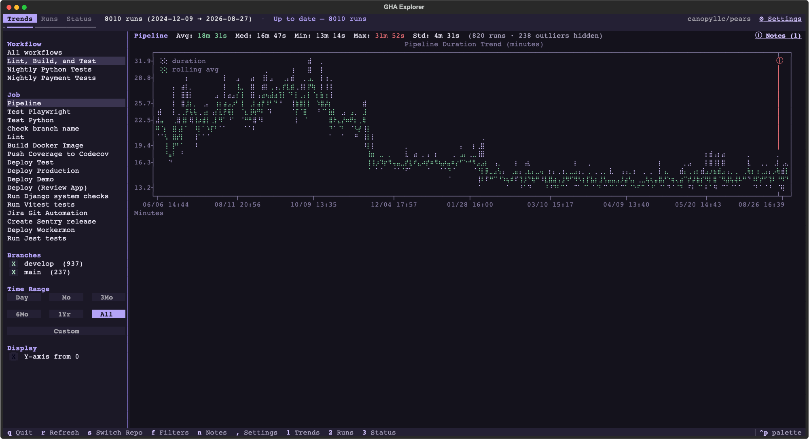

# GHA Explorer

A terminal UI for exploring GitHub Actions workflow timing data. Fetches successful workflow runs from any repo you have access to via the `gh` CLI, caches everything locally in SQLite, and shows interactive trend charts of pipeline and job durations.



## Features

- **Incremental sync** — on launch, cached data displays instantly, then new runs fetch in the background. No re-fetching what you already have.
- **Multi-repo support** — switch between any repo you own or have access to. All data lives in a single local cache DB.
- **Dynamic discovery** — workflows, jobs, and matrix shards all auto-detected from your actual run history. Nothing hardcoded.
- **Trend charts** — duration trends with rolling averages, per-job and pipeline-wide.
- **Job groups** — combine matrix shards (`Tests (1)`, `Tests (2)`) or a renamed job into one entry; grouped jobs get a per-member breakdown chart.
- **Per-repo settings** — full-screen Settings page (`,` or `⚙ Settings`): job groups (create, edit, rename — exclusions and notes follow a rename), and exclude lists for workflows, jobs and branches with Include all / Exclude all (everything included by default). Excluding a workflow removes its runs, and therefore its jobs.
- **Outlier filter** — optional Hampel filter (rolling median + MAD) hides transient spikes — a stuck queue, a flaky runner — from the trend charts while keeping lasting duration changes visible. Tune sensitivity and window in Settings → General.
- **Filters** — by workflow, branch (top branches discovered from the data, multi-select), time range (1d / 1m / 3m / 6m / 1y / all, or a **Custom** from/through date range).
- **Drag to zoom** — click and drag across the trend chart to zoom to that period; it becomes the Custom range (whole days, never finer) and is saved with your filters.
- **Notes** — pin a note to a date/time ("switched runners", "enabled test cache"). It's drawn as a red vertical line on the trend charts with a clickable ⓘ that pops the note in a bubble, so you can eyeball before/after. A note applies to the job you're viewing by default, or to several jobs, or to all jobs (including ones that don't exist yet). Notes on jobs that later get grouped show on the group's chart prefixed with the source job. Each note has a colour (red by default). Manage them via `ⓘ Notes` at the right of the stats line or `n`; a note's bubble has Edit and Delete (with confirmation).
- **Sticky state** — repo, active tab, sidebar collapsed, and per-repo filter selections (workflow, job, branches, time range, y-axis) are saved in the database and restored next launch.
- **Status tab** — live sync phase and progress, GitHub API rate-limit gauge, call/error counters, cache stats, and a streaming log.
- **Resilient** — walks past `gh run list`'s 1000-result cap, handles rate limiting gracefully, and backfill resumes next launch.
- **Dark lavender theme** — plus `--theme` to use any built-in Textual theme (charts recolor to match).

## Requirements

- [`uv`](https://github.com/astral-sh/uv) — provides `uvx`; it fetches Python 3.11+ and the dependencies for you
- Charts use [plotext 6](https://pypi.org/project/plotext/), which ships compiled wheels for macOS (Intel/Apple silicon), Linux (x86_64/aarch64) and Windows x86_64; other platforms need a C compiler to build it
- [`gh`](https://cli.github.com/) — GitHub CLI, authenticated (`gh auth login`)

## Run

No clone needed — it's on PyPI:

```bash
uvx gha-explorer
uvx gha-explorer --repo owner/name   # skip the picker
```

Or install it as a tool so `gha-explorer` is on your PATH:

```bash
uv tool install gha-explorer
gha-explorer --theme catppuccin-mocha   # any built-in Textual theme
uv tool upgrade gha-explorer            # pick up new releases
```

To run the latest unreleased code straight from `main`, point `uvx` at the repo instead:

```bash
uvx --from git+https://github.com/swils23/gha-explorer gha-explorer
```

From a checkout, the single file still runs directly (it carries inline script metadata):

```bash
./gha_explorer.py            # or: uv run --script gha_explorer.py
```

First launch shows a repo picker listing every repo you have access to. Pick one, and it starts fetching. On subsequent launches your choice — plus filters, active tab and sidebar state — is remembered.

### Where data lives

Everything — the runs cache, settings and notes — lives in one SQLite file, `gha-explorer.db`, alongside the log in a per-user directory: `~/.local/share/gha-explorer` (or `$XDG_DATA_HOME/gha-explorer`; `%LOCALAPPDATA%\gha-explorer` on Windows). Set `GHA_EXPLORER_HOME` to put the directory somewhere else, and `gha-explorer --data-dir` prints the resolved path. A checkout that already has a database next to the script keeps using it, and a `cache.db` from before the first release is renamed on first launch.

Settings → General has a **Database** section: change the file's path (to rename or move it — the current database is copied to the new location if nothing is there yet), or **Reveal in Finder / Explorer**. A custom path is remembered in `paths.json` in the data directory; `GHA_EXPLORER_DB` overrides it.

## Keybindings

| Key | Action |
| --- | --- |
| `q` | Quit |
| `r` | Refresh (incremental sync) |
| `R` | Full rescan (re-walk history back to repo creation) |
| `s` | Switch repo (open picker) |
| `f` | Collapse / expand the filter sidebar |
| `n` | Open the notes manager (add / delete notes) |
| `,` | Open Settings for the current repo (`Esc` / Close to return) |
| `Esc` | Close an open note bubble |
| `1` | Trends tab |
| `2` | Runs tab |
| `3` | Status tab (sync progress, API rate limit, log) |

## Architecture

The script is a single file (`gha_explorer.py`) — also packaged as the `gha-explorer` console script via `pyproject.toml` — with four layers:

1. **Database (SQLite, WAL — `gha-explorer.db`)** — `run_jobs` stores the raw `gh run list` + `gh api runs/{id}/jobs` JSON per `run_id`, keyed by repo; `sync_meta` records per repo whether backfill has reached the repo's creation date; `settings` holds sticky UI state and per-repo config (global and per-repo scopes, JSON values); `notes` holds timestamped annotations per repo, each scoped to all jobs or a list of jobs. Never re-fetches the same run.
2. **Fetch** — incremental sync: forward-fetch runs newer than the newest cached run, then backfill backwards in 90-day windows until the repo's creation date. Every list call walks past `gh run list`'s 1000-result cap by moving the upper date bound down and deduping, so busy windows don't silently drop runs. Once backfill completes it's skipped on later launches (`R` forces it).
3. **Aggregation** — stats (mean / median / min / max / stdev) and rolling averages for trend smoothing.
4. **TUI (Textual + plotext)** — tabs with an inline sync status in the top bar, a filter sidebar inside the Trends/Runs tabs, ASCII charts, and a Status tab fed by a shared `SyncStats` object and an in-memory log handler. Charts plot one point per run, so notes are placed between the runs that bracket them, proportional to elapsed time; plotext draws the line and ⓘ, then the ⓘ is made clickable by attaching the note id as Rich style meta.

Everything is derived from the data itself — no hardcoded workflow, job, or branch names, and no automatic grouping: matrix shards appear as separate jobs until you put them in a Group. Repo settings (groups, exclusions, rolling window) are applied on top of the cached runs (`apply_repo_config`) before anything is filtered or charted.

## License

MIT
